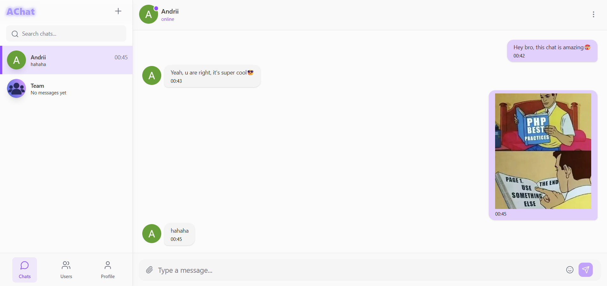

# AChat

**Modern and powerful chat application built with the latest technologies.**

**🚀 Live Demo: [a-chat.xyz](https://a-chat.xyz)**

## 📸 Preview

<p align="center">
  
  &nbsp;
  
</p>

---

## ✨ Features

AChat is a full-featured chat application designed for fast and reliable communication.

- **⚡ Real-Time Messaging:** Instant message delivery using WebSockets (Pusher).
- **👥 Group & Private Chats:** Create group chats or chat one-on-one.
- **🔐 Secure Authentication:** Complete authentication and session management with NextAuth.js.
- **📧 Email Verification:** Email confirmation for new users powered by Resend.
- **🖼️ Image Sharing:** Send images securely stored on AWS S3.
- **🎨 Modern UI:** Clean and responsive interface built with Tailwind CSS and shadcn/ui.
- **🌓 Light & Dark Modes:** Comfortable experience any time of day.
- **✍️ Typing Indicators:** See when someone is typing a message.
- **🟢 Online Status:** Track who is online in real time.

## 🛠️ Tech Stack

The project is built with a modern and powerful tech stack:

- Next.js 15 (App Router)
- TypeScript
- PostgreSQL + Prisma + AWS S3
- NextAuth.js + Resend
- Tailwind CSS + Shadcn
- Pusher

## 🚀 Getting Started

To run the project locally, follow these steps:

### 1. Prerequisites

- [Node.js](https://nodejs.org/en/)
- [Yarn](https://yarnpkg.com/)

### 2. Installation

1.  **Clone the repository:**

    ```bash
    git clone https://github.com/Andrii12390/Achat.git
    cd Achat
    ```

2.  **Install dependencies:**

    ```bash
    yarn install
    ```

3.  **Set up environment variables:**  
    Create a `.env` file by copying `env.example` and fill in your data.

4.  **Generate Prisma Client:**  
    This command will generate types based on your database schema.

    ```bash
    yarn prisma generate
    ```

5.  **Start the development server:**
    ```bash
    yarn dev
    ```

Now open [http://localhost:3000](http://localhost:3000) in your browser.

## 📄 License

This project is licensed under the **MIT License**. See the `LICENSE` file for details.

---

**⭐ Star if you like it! ⭐**

